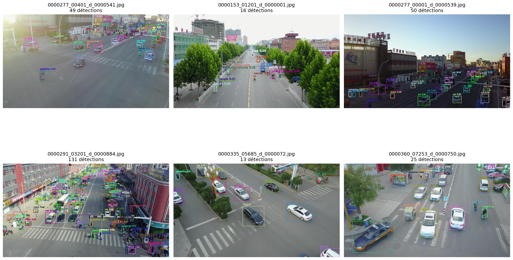

# Real-Time Drone Object Detection - VisDrone
[](https://www.python.org/)
[](https://pytorch.org/)
[](https://github.com/ultralytics/ultralytics)
[](https://fastapi.tiangolo.com/)

End-to-end computer vision system for aerial object detection using the VisDrone dataset. The model detects and tracks vehicles, pedestrians and cyclists in real-time drone footage, deployed via REST API and integrated with live hardware through network protocol reverse engineering.

**📄 [Read the full technical blog post](https://elouanxp.github.io/projects/drone-object-detection)** for detailed methodology, experiments, and analysis.

---

## Results

### Model Performance (VisDrone Validation Set)

| Model | mAP50 | mAP50-95 | Precision | Recall | CPU Latency | FPS |
|-------|-------|----------|-----------|--------|-------------|-----|
| YOLOv8n | 33.2% | 19.2% | 44.7% | 33.3% | 71ms | 14 |
| **YOLO26n** | **37.5%** | **19.9%** | **46.5%** | **35.8%** | **45ms** | **22** |

**Key improvements:** +4.3% mAP50, +36% faster inference, +2.5% higher recall

### Per-Class Performance (YOLO26n)

| Class | mAP50 | Precision | Recall | Challenge |
|-------|-------|-----------|--------|-----------|
| **Vehicle** | 68.1% | 66.0% | 62.6% | ✅ Large objects, well-detected |
| **Pedestrian** | 33.3% | 43.5% | 34.8% | ⚠️ Small, dense crowds |
| **Bike** | 11.0% | 29.9% | 9.9% | ❌ Tiny objects (12×18 px) |

### Hardware Integration (Syma Z3 Pro Drone)

Real-time inference on live drone video stream via reverse-engineered TCP protocol:

| Metric | Value |
|--------|-------|
| Display FPS | 27.5 |
| Inference Latency | 62.4 ms |
| Frame Drop Rate | 0.0% |
| End-to-End Latency | ~200ms |
| WiFi Range | ~30m |



---

## Project Structure
```
drone-object-detection/
│
├── data/
│   ├── raw/                          # VisDrone dataset (download separately)
│   │   ├── visdrone.yaml             # YOLO config file
│   │   └── test_video.mp4            # Sample test video
│   └── processed/                    # Converted YOLO format (train/val)
│
├── models/
│   ├── baseline_yolov8n/             # Initial YOLOv8n training
│   └── yolo26n_visdrone/             # YOLO26n (latest, best performance)
│       └── weights/
│           ├── best.pt               # Best checkpoint
│           └── best.onnx             # ONNX export
│
├── notebooks/
│   ├── data_exploration.ipynb        # EDA, object size analysis, class distribution
│   ├── training_model_colab.ipynb    # GPU training on Google Colab
│   └── evaluating_model.ipynb        # Failure analysis, robustness testing
│
├── src/
│   ├── config.py                     # Paths and constants
│   ├── convert_to_yolo.py            # VisDrone → YOLO format converter
│   ├── model_test_image.py           # Single image inference
│   ├── model_test_video.py           # Video inference with metrics
│   ├── live_detection.py             # Real-time drone stream inference (TCP/UDP)
│   ├── optimize_model.py             # ONNX export and benchmarking
│   └── analyze_logs.py               # API performance analysis
│
├── deployment/
│   └── api.py                        # FastAPI REST service
│
├── outputs/
│   ├── plots/                        # Visualizations (failure analysis, robustness)
│   ├── logs/                         # API request logs (JSON)
│   ├── videos/                       # Recorded sessions with detections
│   └── *.csv                         # Robustness test results
│
├── requirements.txt
└── README.md
```

---

## Quickstart

### Prerequisites
```bash
git clone https://github.com/elouanXP/drone-object-detection
cd drone-object-detection
python -m venv venv
source venv/bin/activate        # Windows: venv\Scripts\activate
pip install -r requirements.txt
```

### Dataset

Download the [VisDrone-DET2019 dataset](https://github.com/VisDrone/VisDrone-Dataset) and extract:
- `VisDrone2019-DET-train` → `data/raw/`
- `VisDrone2019-DET-val` → `data/raw/`

Convert to YOLO format:
```bash
python src/convert_to_yolo.py
```

### Training (Google Colab Recommended)

Open `notebooks/training_model_colab.ipynb` in Google Colab with T4 GPU:
- Training time: ~1.5 hours (35 epochs)
- Download trained weights: `yolo26n_trained.zip`

### Inference

**Single Image:**
```bash
python src/model_test_image.py --image data/processed/val/images/0000001.jpg
```

**Video:**
```bash
python src/model_test_video.py --video data/raw/test_video.mp4
```

**Live Drone Stream (Syma Z3 Pro):**
```bash
python src/live_detection.py
```
Requires connection to drone WiFi (`192.168.30.1`). Press `q` to quit.

### REST API

Start the FastAPI server:
```bash
python deployment/api.py
```

Access interactive docs: `http://localhost:8000/docs`

**Test with curl:**
```bash
curl -X POST "http://localhost:8000/predict" \
  -F "file=@data/processed/val/images/0000001.jpg" \
  -F "conf_threshold=0.3"
```
---

## Technical Stack

| Category | Tools |
|----------|-------|
| Deep Learning | PyTorch, Ultralytics YOLO26 |
| Computer Vision | OpenCV, PIL|
| API | FastAPI|
| Optimization | ONNX Runtime |
| Tracking | ByteTrack (Kalman filter) |
| Video Decode | ffmpeg |
| Network Analysis | nmap, Wireshark |
| Experiment Tracking | MLflow (optional) |
| Visualization | matplotlib, seaborn |

---

## Author

[elouanXP](https://github.com/elouanXP/) | [Portfolio](https://elouanxp.github.io)